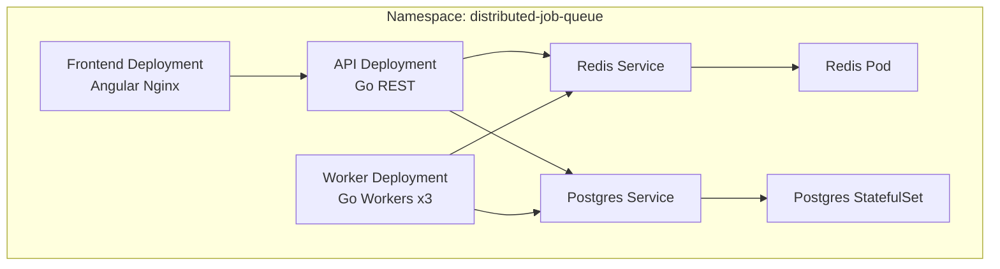

# Kubernetes Architecture & Manifests

This document explains the Kubernetes deployment topology created in **Phase 6.3**. 

## 1. Kubernetes Architecture

The setup mirrors the Docker Compose environment but uses native Kubernetes resources.



## 2. Namespace
**File:** `namespace.yaml`
All resources are deployed to a dedicated namespace called `distributed-job-queue` to ensure logical isolation.

## 3. ConfigMap & Secret
**Files:** `configmap.yaml`, `secret.yaml`
- **ConfigMap (`djq-config`)**: Contains all non-sensitive environment variables such as `PORT`, `REDIS_URL`, and Postgres connection details.
- **Secret (`djq-secret`)**: Contains dummy passwords like `POSTGRES_PASSWORD`. **Important**: For production deployments, this file should not be committed to source control and should use a proper secret manager.

## 4. PostgreSQL
**File:** `postgres.yaml`
- Deployed as a `StatefulSet` with a 1GB `PersistentVolumeClaim` (PVC) for data retention.
- Internal service `postgres:5432` makes the database accessible to the API and Workers.
- Health checks use `pg_isready`.

## 5. Redis
**File:** `redis.yaml`
- Deployed as a standard `Deployment` since persistence is not strictly critical for this queue implementation.
- Internal service `redis:6379`.
- Health checks use `redis-cli ping`.

## 6. API Deployment
**File:** `api.yaml`
- Runs the `distributedjobqueue-api:latest` image.
- Expects to connect to `postgres` and `redis` services.
- Defines modest CPU (100m - 500m) and Memory (128Mi - 512Mi) resource limits.
- Exposes port 8080 internally via a Service.
- Uses HTTP `GET /health` for liveness and readiness probes.

## 7. Worker Deployment
**File:** `worker.yaml`
- Runs the `distributedjobqueue-worker:latest` image.
- Scaled to **3 replicas** by default to demonstrate distributed processing.
- Connects to the same backing stores as the API.
- Has no exposed ports or HTTP probes, as it's a headless background process.

## 8. Frontend Deployment
**File:** `frontend.yaml`
- Runs the `distributedjobqueue-frontend:latest` image.
- Serves the compiled Angular app via Nginx and proxies `/api` and `/ws` to the API service.
- Includes HTTP probes targeting the root path `/`.

## 9. Migration Strategy
There is no separate Migration Job because the Go application logic safely executes `AutoMigrate()` against the database on startup. When the API or Worker starts, they will apply `000001` and `000002` migrations seamlessly.

## 10. Local Image Handling
Since these manifests reference `latest` tags that are built locally (from Phase 6.2), they will work in Docker Desktop's Kubernetes out of the box because it shares the Docker image cache.

For other environments like Minikube, you must load the images manually first:
```bash
minikube image load distributedjobqueue-api:latest
minikube image load distributedjobqueue-worker:latest
minikube image load distributedjobqueue-frontend:latest
```

## Deployment Instructions

Apply all manifests using Kustomize:
```bash
kubectl apply -k 3-infrastructure/kubernetes/
```
