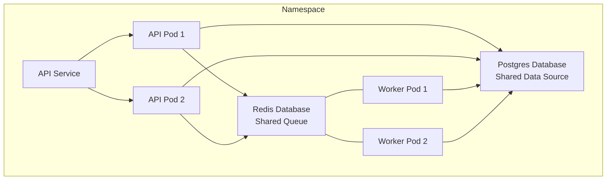

# Kubernetes Scaling & Configuration

This document outlines the Kubernetes scaling and configuration applied to the Distributed Job Queue during **Phase 6.5**.

## 1. Scaling Architecture

The Distributed Job Queue leverages Kubernetes primitives to scale both API load and background processing independently, while preserving single sources of truth for data and queues.



- **API Replicas (Default 2)**: The stateless REST API runs across multiple replicas. The Kubernetes `api` Service inherently acts as an internal load balancer, randomly distributing traffic (like `POST /jobs` or WebSocket requests) evenly across all healthy API pods.
- **Worker Replicas (Default 2)**: The worker pods are headless background processors. They independently subscribe to the same Redis queue. Because Redis implements atomic popping (like `BLPOP`), multiple workers safely pull discrete jobs off the queue simultaneously without duplication.

## 2. Rolling Updates & Zero Downtime

We configured both Deployments to use a `RollingUpdate` strategy (`maxSurge: 1`, `maxUnavailable: 0`). When you deploy a new image version, Kubernetes guarantees zero downtime by spinning up the new Pods before shutting down the old ones.

### API Graceful Shutdown
```yaml
terminationGracePeriodSeconds: 30
```
When an API pod receives a `SIGTERM`, it is immediately removed from the Kubernetes Service endpoints (so it receives no new traffic). It then uses a 30-second window to gracefully drain any active HTTP connections and WebSocket tunnels before fully terminating.

### Worker Graceful Shutdown
```yaml
terminationGracePeriodSeconds: 60
```
When a worker pod is scheduled for termination, it might be in the middle of a complex, long-running job. The Go worker listens for the `SIGTERM` signal, stops pulling new jobs from Redis, and is granted up to 60 seconds to either finish the current job or safely push it back to the queue (Nack).

## 3. Manual Scaling Commands

You can horizontally scale these components on demand using the Kubernetes CLI:

**Scale the API**:
```bash
kubectl scale deployment api --replicas=3 -n distributed-job-queue
```

**Scale the Workers**:
```bash
kubectl scale deployment worker --replicas=5 -n distributed-job-queue
```

*Note: Postgres and Redis are currently configured as single-instance stateful deployments and should not be scaled using these commands.*

## 4. Automatic Failure Recovery

Because we use Kubernetes `Deployments`, the cluster acts as a self-healing reconciliation loop:
1. **Pod Failure**: If a worker pod crashes or you intentionally delete it (`kubectl delete pod <worker-pod> -n distributed-job-queue`), the Deployment controller instantly notices that the current replica count dropped below the desired count.
2. **Replacement**: A replacement pod is instantly scheduled and spun up.
3. **Robustness**: Because jobs are securely tracked in Postgres/Redis and the workers are stateless executors, no job data is lost during the failure or recovery. The new pod simply picks up the queue where the dead pod left off.

## 5. Health Probes & Resource Limits

To ensure Kubernetes makes smart scheduling and routing decisions, we explicitly defined:
- **Requests & Limits**: API and Workers require `100m CPU / 128Mi RAM` and are capped at `500m CPU / 512Mi RAM`. This prevents a runaway process from starving the entire node.
- **Liveness Probes**: The API is constantly checked at `/health`. If the API process deadlocks and fails this check, Kubernetes automatically restarts the pod.
- **Readiness Probes**: The API only receives traffic from the `api` Service *after* its Readiness probe passes.
