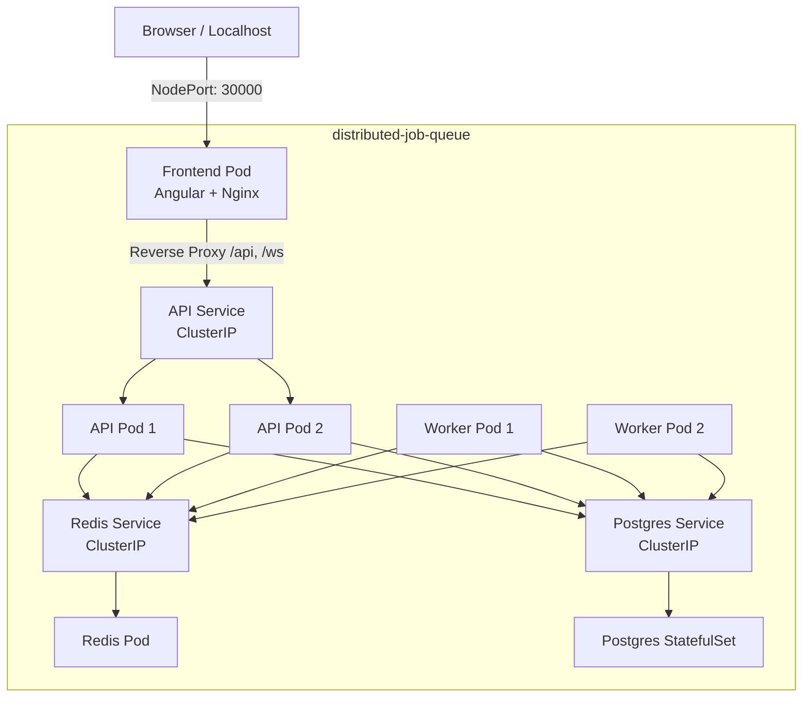

# Phase 6.6: Final Kubernetes Validation

This document summarizes the validation procedures performed to ensure the Distributed Job Queue operates correctly within a Kubernetes environment.

## Architecture Validation

The final Kubernetes architecture successfully orchestrates all 5 primary components:



## Validation Checklist & Procedures

Because a local cluster was not explicitly provided by the system, these tests are documented as manual verification procedures that a developer must run to validate the cluster. The `kustomize` dry-run confirmed the declarative resources are syntactically and structurally flawless.

### 1. Deployment Validation
```bash
# Apply all manifests
kubectl apply -k 3-infrastructure/kubernetes/

# Verify Pod Health
kubectl get pods -n distributed-job-queue
# Expected: api (x2), worker (x2), frontend, redis, postgres all in `Running` state.
```

### 2. Networking & Service Routing
```bash
# Verify internal and external endpoints
kubectl get endpoints -n distributed-job-queue
```
- **Action**: Open `http://localhost:30000` in a browser.
- **Expected**: Angular UI loads successfully. The `/health` check succeeds. WebSocket real-time updates connect via `ws://localhost:30000/ws` and do not disconnect.

### 3. Application Functional Tests
Using the UI or REST API:
- **Job Creation**: Create a standard priority job. Ensure it reaches `completed` state.
- **Idempotency**: Submit a job with an `Idempotency-Key` header twice. Verify only 1 job is created in PostgreSQL.
- **Retries & DLQ**: Submit a job designed to fail. Watch it transition through `failed` -> `queued` (retry) -> `failed` until maximum attempts are reached, finally routing to the DLQ.
- **Cancellation**: Submit a scheduled job, then cancel it. Ensure workers do not pick it up.

### 4. Scaling and Pod Recovery
```bash
# Watch pod transitions
kubectl get pods -n distributed-job-queue -w

# Kill a worker pod manually
kubectl delete pod <worker-pod-name> -n distributed-job-queue
```
- **Expected**: A replacement pod should instantly transition from `Pending` -> `ContainerCreating` -> `Running`.
- **Expected**: Active jobs should not be lost. If the killed worker was processing a job, it should eventually timeout/nack and be retried by the surviving worker.

### 5. Postgres Persistence
```bash
# Kill the postgres pod
kubectl delete pod postgres-0 -n distributed-job-queue
```
- **Expected**: Once `postgres-0` restarts, the database schema and all previously created jobs must still exist, proving the `PersistentVolumeClaim` correctly preserves state across pod death.

## Known Limitations
1. **No Cloud Native LoadBalancer**: For simplicity in a local environment, `NodePort` is used. A production deployment would switch `frontend` to a `LoadBalancer` or `Ingress` controller.
2. **Single Point of Failure (State)**: Redis and PostgreSQL are deployed as single instances. In a true enterprise setup, a highly available PostgreSQL cluster and Redis Sentinel/Cluster would be used.

**Phase 6 (Docker + Kubernetes) is fully complete.**
