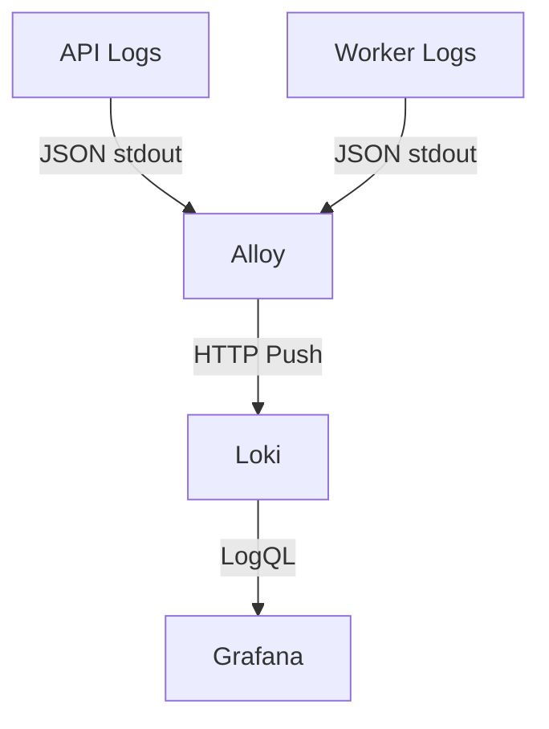

# Centralized Logging with Loki (Phase 7.3)

This document details the centralized logging infrastructure added to the Distributed Job Queue during Phase 7.3. We leverage Grafana Loki as the log aggregation system and Grafana Alloy as the collector.

## Architecture



## How It Works

1. **Application Logging**: The Go application uses `log/slog`. In `production` mode (triggered by `APP_ENV=production`), `slog` outputs logs as structured JSON to `stdout`/`stderr`.
2. **Log Collection**: Grafana Alloy runs as a daemon (or container). It connects to the Docker socket or Kubernetes API to automatically discover `api` and `worker` containers/pods, scrape their `stdout`, parse the JSON, and attach low-cardinality labels (like `service`, `level`, `pod`, etc.).
3. **Log Storage**: Alloy pushes these logs to Loki. Loki uses local filesystem storage with an inverted index that maps labels to log streams, while keeping the raw JSON payload searchable.
4. **Log Exploration**: Grafana automatically provisions the Loki datasource. You can query logs directly from Grafana's Explore panel.

## Accessing Logs

### Local Development (Docker Compose)
1. Start the stack: `docker compose up -d`
2. Open Grafana: [http://localhost:3000](http://localhost:3000)
3. Navigate to **Explore** (compass icon on the left sidebar).
4. Select **Loki** from the datasource dropdown at the top.

### Kubernetes Integration
1. Apply the manifests:
   ```bash
   kubectl kustomize --load-restrictor LoadRestrictionsNone 3-infrastructure/kubernetes/ | kubectl apply -f -
   ```
2. Open Grafana via NodePort `30002` (e.g., `http://localhost:30002`).
3. Navigate to **Explore** > **Loki**.

## LogQL Examples

Loki uses LogQL, which is similar to PromQL.

**1. Filter by Service:**
```logql
{service="api"}
```
```logql
{service="worker"}
```

**2. Filter by Level:**
```logql
{service="worker", level="ERROR"}
```

**3. Search for a specific Job ID (Full Text Search):**
*Note: `job_id` is NOT a label to maintain low cardinality. It is queried from the log line itself.*
```logql
{service="worker"} |= "job_12345"
```

**4. Parse JSON and filter by JSON properties:**
```logql
{service="worker"} | json | job_type="image_processing"
```

## Failure Behavior
The logging infrastructure is strictly best-effort. If Loki or Alloy go offline:
- Jobs will continue to be created and processed.
- API and Workers will not block or crash.
- Existing Prometheus metrics will still function.
- PostgreSQL and Redis remain unaffected.
