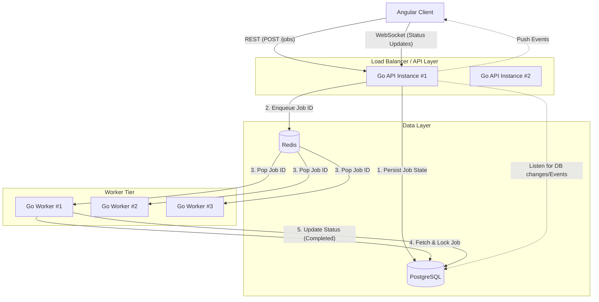

# System Architecture

The Distributed Job Queue leverages a decoupled architecture where the API handles client ingestion while background workers process tasks asynchronously. 

## High-Level Architecture Diagram

## Core Design Principles

1. **Database as the Source of Truth**: Redis is strictly used as an ephemeral transport mechanism (the queue). If Redis crashes, jobs are not lost because PostgreSQL holds the definitive state of every job. 
2. **Stateless API**: The Go API instances do not hold job state in memory. They can be scaled horizontally without session stickiness.
3. **Decoupled Workers**: Workers connect directly to Redis and PostgreSQL. They are completely unaware of the HTTP API, allowing them to scale independently based on processing load.
4. **Event-Driven UI**: The Angular client relies on WebSockets for UI reactivity, eliminating expensive long-polling against the database.
