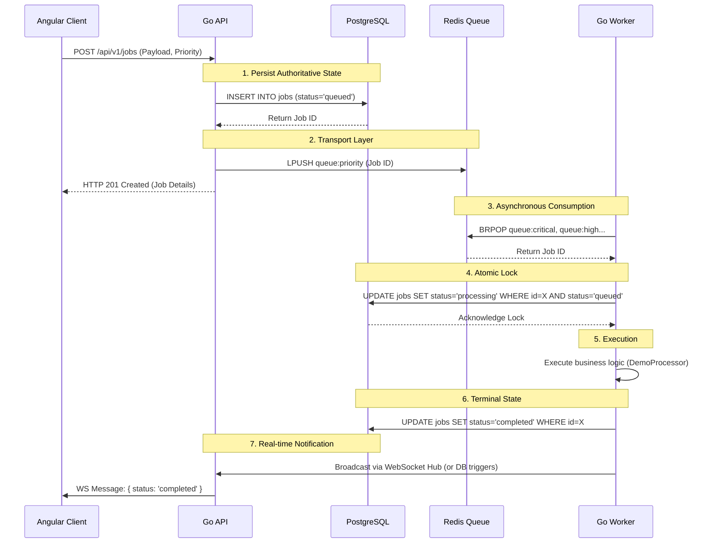

# Data Flow

The following describes the step-by-step flow of data through the system for a standard immediate job.

## Complete Job Flow

## Flow Guarantees
- **At-Least-Once Delivery**: Redis `BRPOP` pulls the job ID. If the worker crashes immediately, the job remains in PostgreSQL as `queued`. The Scheduler (recovery mechanism) will eventually detect it and re-enqueue it.
- **Exactly-Once Processing**: Even if Redis delivers the same Job ID to two workers (duplicate delivery), only ONE worker will successfully execute the `UPDATE ... WHERE status='queued'` lock in PostgreSQL. The second worker will receive a 0-rows-affected response and safely abort.
