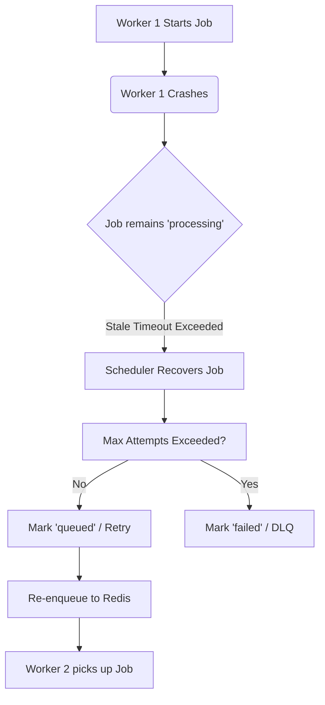

# Fault Tolerance

## Objective

The objective of this phase is to ensure the Distributed Job Queue is robust and handles component failures safely without silent job loss, corruption, or uncontrolled crashes. We rely heavily on the existing retry, DLQ, timeout recovery, and architectural paradigms (PostgreSQL as the source of truth, Redis as transport, WebSocket as notification).

## Important Architectural Rule
- **PostgreSQL** = Source of Truth. Job state, retries, and errors are durably saved here.
- **Redis** = Queue/Transport. Ephemeral broker for rapid distribution.
- **WebSocket** = Real-time Notifications. Ephemeral updates that do not affect the job lifecycle.

## Failure Scenarios and Handling

### 1. API Failure
If the Go API process crashes or is restarted:
- **Data Persistence**: Jobs in PostgreSQL and Redis remain safe.
- **Queue State**: Workers connected to Redis continue processing the existing queue.
- **On Restart**: The API reconnects to PostgreSQL and Redis automatically. The REST API health endpoint confirms availability.

### 2. Worker Failure
If a worker crashes while processing a job:
- **Detection**: The job remains in the `processing` state in PostgreSQL.
- **Recovery**: The background Scheduler's Stale Job Recovery runs periodically. It detects jobs stuck in `processing` beyond the configured timeout.
- **Re-queue**: The scheduler pulls the job back, marks it for retry (subject to max attempts), and re-enqueues it to Redis for another healthy worker to pick up.

### 3. Redis Failure
If the Redis broker goes offline or becomes unreachable:
- **Enqueue at Creation**: The API persists the job to PostgreSQL but fails to enqueue to Redis. The job is immediately marked as `failed` in PostgreSQL (source of truth) with an enqueue error, rather than staying stuck silently in `queued`.
- **Scheduler Enqueue**: If due or stale jobs are fetched by the scheduler but Redis is down, they are immediately marked as `failed` in PostgreSQL. This ensures visibility (e.g., via DLQ metrics or UI) instead of silent background loss.

### 4. PostgreSQL Failure
If the Database becomes unreachable:
- **Health Checks**: The REST API health checks fail and report DB unavailability.
- **API Requests**: Operations return standard HTTP 500 Internal Server errors. The API does not falsely pretend the job was created.
- **Workers**: Workers polling jobs may encounter DB update errors. They log these errors and continue attempting to process the queue, relying on standard DB connection pooling reconnections.

### 5. Job Processing Failure (Panic)
If a specific job's payload causes the `Process()` function to crash/panic:
- **Worker Survival**: The `worker.go` runtime wraps job execution in a `defer recover()` block.
- **Error Conversion**: The panic is caught, converted into a standard processing error, and fed into the standard retry/DLQ flow.
- **Outcome**: The worker survives and proceeds to the next job in the queue.

### 6. Retry Failure
If the worker executes the job, it fails, and the `RetryManager` is invoked:
- The job's state is updated to `scheduled` in PostgreSQL with a delayed next-run time.
- The actual re-enqueue to Redis happens later via the Scheduler, reducing the immediate dependency on Redis during the failure path.

### 7. Scheduler Failure
If the Scheduler stops or is restarted:
- Scheduled and deferred jobs remain persisted safely in PostgreSQL.
- **On Restart**: The new Scheduler immediately fetches any scheduled jobs whose execution time is past due and enqueues them. Duplicate protection ensures jobs already queued are not pulled twice.

### 8. WebSocket Failure
If the WebSocket connection drops or encounters issues:
- **Job Lifecycle**: Processing continues completely uninterrupted.
- **Client Recovery**: The frontend will miss real-time events, but upon reconnection or manual refresh, the REST API fetches the current, authoritative state from PostgreSQL.

### 9. Graceful Shutdown
When receiving `SIGINT` or `SIGTERM`:
- The API stops accepting new requests.
- The Worker Pool stops fetching new jobs from Redis.
- Active jobs finish processing (within a shutdown timeout limit).
- Redis, PostgreSQL, and HTTP resources are safely closed.

### 10. Multi-Worker Failures
In a horizontally scaled environment with multiple workers:
- A single worker failure only stalls the job it was currently processing.
- Other workers independently continue `BLPOP` polling from Redis.
- The stalled job is eventually recovered by any instance running a Scheduler and re-enqueued for the surviving workers.

## Conceptual Failure Flow (Stale Job)

