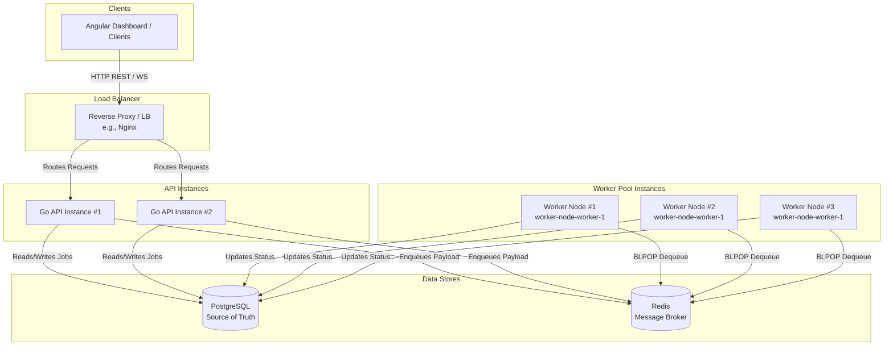

# Phase 4.1: Horizontal Scaling

## Overview

Horizontal scaling refers to the ability to add more machines (or instances) to a system to handle increased load, as opposed to vertical scaling (upgrading a single machine with more CPU/RAM).

In our Distributed Job Queue architecture, both the Go API and the Worker Pool can be scaled independently, sharing the common underlying PostgreSQL and Redis data stores.

## Architecture Concept



## Scaling the API

The Go API is completely **stateless**. It relies entirely on PostgreSQL for persistence and Redis for the queue. This means:
1. You can spin up as many API instances as needed.
2. A Load Balancer (like Nginx, HAProxy, or a cloud LB like AWS ALB) sits in front of the API instances to route incoming traffic in a round-robin or least-connections fashion.
3. Configuration differences (like `INSTANCE_ID` and `PORT`) can be supplied dynamically via environment variables without hardcoding instance-specific values in the code.

## Scaling the Workers

Workers continuously poll the Redis queue. We utilize Redis `BLPOP` to atomically pop items from the queue. Because Redis operations are single-threaded and atomic, multiple workers connecting to the same Redis instance will not process duplicate jobs.
- The load is automatically distributed across all available workers.
- Each worker instance connects to the same Redis server and PostgreSQL database.
- We utilize `INSTANCE_ID` to uniquely identify the workers (e.g. `worker-node-1-worker-1`), ensuring better tracing in logs.

## Connection Pool Considerations

**Important:** Scaling the number of instances means scaling the number of database and Redis connections.
- Each Go API and Worker instance manages its own PostgreSQL and Redis connection pool.
- `Total Active DB Connections = (Max API Connections * Num API Instances) + (Max Worker Connections * Num Worker Instances)`
- If scaled improperly, the system might exhaust PostgreSQL's `max_connections` (default 100). Tuning the database config or introducing a connection pooler like `PgBouncer` is required for extreme scaling.

## WebSocket Limitations

Currently, the WebSocket Hub lives in-memory on the API instance that accepted the connection.
Because we don't have a centralized Event Bus (like Redis Pub/Sub), if an event (e.g., job completed) occurs in a Worker instance, it only notifies the `wsHub` running inside its own process. 
If an Angular client is connected to `API Instance 1`, it will **not** receive real-time notifications about jobs processed by `Worker Node 1` or `API Instance 2`.

To solve this in production, a Redis Pub/Sub channel could be introduced to broadcast internal events to all API nodes, which then relay the message to their connected WebSocket clients.

## Example Local Scaling Setup

Using Docker Compose, we can easily emulate a horizontally scaled environment:

```bash
# Run 1 API instance and 3 Worker instances
docker compose up --scale worker=3 --build
```
This runs 3 separate worker containers processing jobs simultaneously, all connected to the central Redis container.
