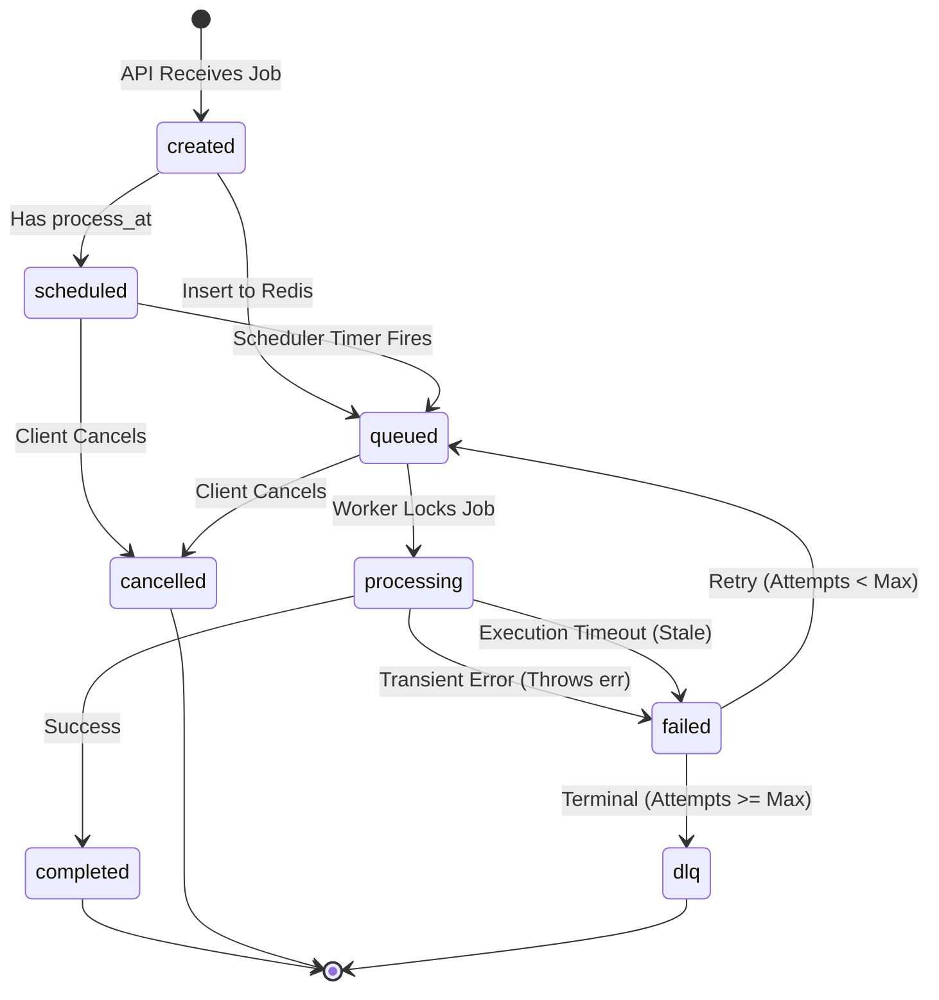

# Job Lifecycle

The Distributed Job Queue enforces a strict state machine for all jobs, governed by the PostgreSQL `jobs` table.

## Complete Lifecycle Diagram

## State Definitions

- `created`: The initial transient state when the API first constructs the job struct.
- `scheduled`: The job is persisted in PostgreSQL with a future `process_at` timestamp. It is NOT in Redis.
- `queued`: The job is in Redis waiting for a worker to pick it up.
- `processing`: A worker has exclusively locked the job in PostgreSQL and is executing the business logic.
- `completed`: The worker finished the job without errors.
- `failed`: The worker encountered an error, or the job timed out while `processing`.
- `dlq`: The job reached its `max_retries` limit and was sent to the Dead Letter Queue for manual inspection.
- `cancelled`: A client manually terminated the job before it started processing.

## Special Flows

### 1. Scheduling Flow
When a user schedules a job for the future, the API persists it with `status='scheduled'` and DOES NOT push it to Redis. A background `Scheduler` routine periodically polls PostgreSQL for jobs where `status='scheduled' AND process_at <= NOW()`. When found, it pushes them to Redis and updates their status to `queued`.

### 2. Timeout & Recovery Flow
If a worker crashes while a job is in the `processing` state, the job remains stuck. The `Scheduler` routine periodically scans PostgreSQL for jobs where `status='processing' AND updated_at < NOW() - timeout_threshold`. It forcibly marks them as `failed` so the existing retry loop can re-enqueue them if attempts remain.

### 3. Retry Flow
When a job returns an error, the worker marks it as `failed`. If `attempts < max_retries`, an exponential backoff timer determines when it should be retried. The `Scheduler` treats it similarly to a scheduled job, re-pushing it to Redis when its backoff timer expires. The job retains the same `ID` throughout all retries.
